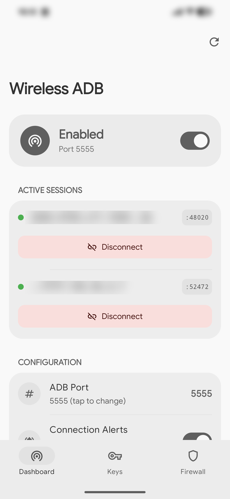
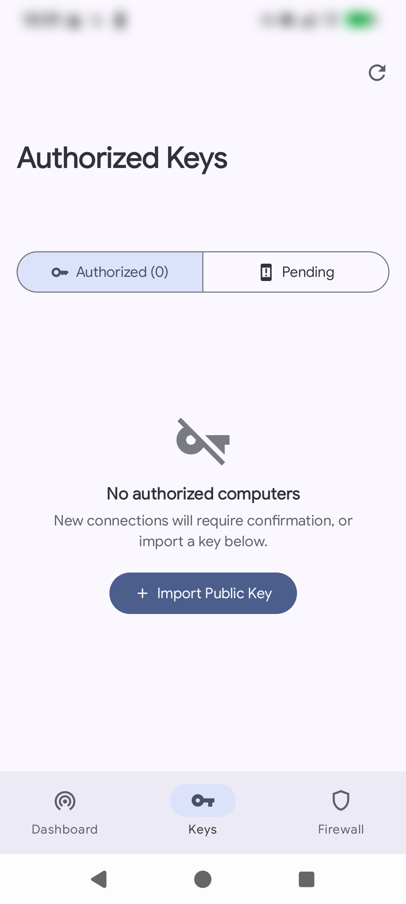
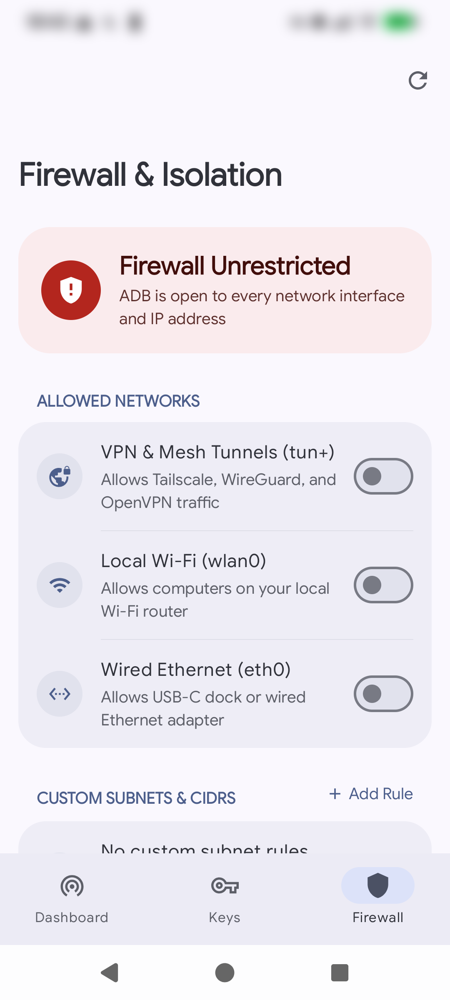

# WADBD — Wireless ADB Controller

Network isolation, active connection alerts, and native Material 3 controls for Android's wireless ADB daemon.

  
  
  

---

## Features

* **Firewall Isolation:** Drops all incoming ADB packets on unapproved interfaces using kernel `iptables`. Restrict ADB to local Wi-Fi (`wlan0`), dynamic VPN tunnels (`tun+`), or private CIDR subnets (e.g. `192.168.1.0/24`, Tailscale mesh).
* **Native Material 3 App:** Manage ports, connected sessions, firewall rules, and keys through a modern Material You app with Quick Settings Tile integration.
* **Active Session Alerts:** Real-time ongoing system notifications displaying the connected machine identity (`user@laptop`) and remote IP, with an interactive **Disconnect** action button.
* **RSA Key Manager:** View and revoke authorized keys, import public keys directly, and approve or drop pending unauthorized connection attempts.
* **Boot Persistence:** Automatically restores wireless ADB and applies all firewall bindings on system boot.

---

## Installation

1. Download the flashable module ZIP (`wadbd-vX.X.zip`) from [Releases](https://github.com/bgwastu/wadbd/releases).
2. Flash in **KernelSU**, **Magisk**, or **APatch**.
3. Reboot your device.
4. Launch the **WADBD** app from your launcher or manage via terminal with `wadbd`.

---

## CLI Reference

Run `wadbd` in a root shell (`su`):

| Command | Description |
| :--- | :--- |
| `wadbd on [port]` | Enable wireless ADB (default: 5555) |
| `wadbd off` | Disable wireless ADB and stop daemon |
| `wadbd status` | Show status, connected clients, and firewall rules |
| `wadbd bind <target>` | Restrict ADB to interface (`wlan0`), tunnel (`tun+`), or CIDR |
| `wadbd unbind <target>` | Remove an interface or subnet restriction |
| `wadbd unbind-all` | Remove all restrictions (expose ADB to all networks) |
| `wadbd bind-status` | Display active iptables rules and interface states |
| `wadbd enable-on-boot [port]` | Enable wireless ADB automatically on system boot |
| `wadbd disable-on-boot` | Disable boot persistence |
| `wadbd notify [on\|off\|status]` | Control real-time active connection notifications |
| `wadbd --list-keys` | List all authorized computers and fingerprints |
| `wadbd --import-key <path>` | Pre-authorize a computer's `adbkey.pub` |
| `wadbd --remove-key <id>` | Revoke a specific authorized key |
| `wadbd --clear-keys` | Revoke all authorized keys |

---

## License
MIT
